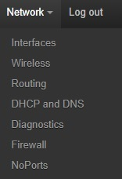
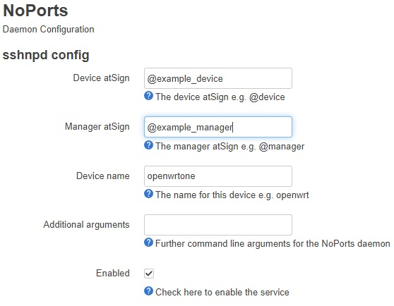

<a href="https://atsign.com#gh-light-mode-only"></a><a href="https://atsign.com#gh-dark-mode-only"></a>

# Atsign OpenWrt packages

This repo contains the source code to build packages for
[OpenWrt](https://openwrt.org/), a Linux operating system targeting embedded
devices.

OpenWrt is very popular with device manufacturers, and we want to make it
easy to run our stuff there.

## Packages

### Upstream support in 25.12 and SNAPSHOT

[csshnpd](https://github.com/openwrt/packages/tree/master/net/csshnpd)
has been accepted upstream in
[openwrt/packages](https://github.com/openwrt/packages), and
[luci-app-csshnpd](https://github.com/openwrt/luci/tree/master/applications/luci-app-csshnpd)
is in [openwrt/luci](https://github.com/openwrt/luci). So if you're running
25.12 or a SNAPSHOT build, NoPorts can be installed with:

```sh
apk update
apk add luci-app-csshnpd
```

or if you just want the command line app:

```sh
apk update
apk add csshnpd
```

### csshnpd

This package contains our
[C NoPorts daemon](https://github.com/atsign-foundation/noports/tree/trunk/packages/c/sshnpd)

#### Installing csshnpd

Once an .ipk file has been created (e.g. `csshnpd_0.2.0-1_x86_64.ipk`) it
should be copied to the target OpenWRT system and installed with `opkg`:

```sh
opkg install csshnpd_0.2.0-1_x86_64.ipk
```

NB that command line will vary according to version and platform architecture.

#### Configuring sshnpd

The config is held in `/etc/config/sshnpd`

Use your favourite editor to set `atsign`, `manager` and `device` to the
atSigns and name you wish to use, and `otp` to the One Time Password (OTP)
or Semi-Permanent Password (SPP) to be used for enrollment.

`enabled` needs to be changed to `1`

#### Getting atSign keys in place

sshnpd expect to find keys in `$HOME/.atsign/keys`.

Once the config has been customised an atKeys file can be generated using
the `at_enroll.sh` script.

#### Starting the daemon

Run:

```sh
/etc/init.d/sshnpd start
```

### luci-app-csshnpd

This is a LuCI app that can be used to configure sshnpd without editing
`/etc/config/sshnpd` at the command line

#### Installing luci-app-csshnpd

Once an .ipk file has been created (e.g.
`luci-app-csshnpd_24.294.58918.40ad298_all.ipk`) it should be copied to
the target OpenWRT system and installed with `opkg`:

```sh
opkg install luci-app-csshnpd_24.294.58918.40ad298_all.ipk
```

#### Using luci-app-csshnpd

Once installed there will be a `NoPorts` menu item under `Network`:



Clicking that brings up the sshnpd config form:



Fill out the atSigns and device name, then click the enable button.

To start the daemon for the first time go to System->Startup then
press the `Start` button beside `sshnpd`.

## Development Environment Setup

Please start by setting up an OpenWrt toolchain following the steps in their
[Developer guide](https://openwrt.org/docs/guide-developer/start)

If you've got past
["Hello World!" for OpenWrt](https://openwrt.org/docs/guide-developer/helloworld/start)
then you're ready to use this.

### Using this repo as a feed

First clone this repo from GitHub.

Then create a `feeds.conf` in the root of the OpenWrt build tree e.g.:

```
src-link atsign /home/chris/git/github.com/atsign-foundation/Atsign_OpenWrt_packages/packages
```

You'll need to change `/home/chris/git/github.com/atsign-foundation/`
to wherever you cloned this repo.

## Old packages

### python packages

We previously packaged the Python3 atSDK and sshnpd in:

* lang/python/python-atsdk
* lang/python/python-sshnpd

These have been removed to prevent conflicts with older build tool chains.
The branch
[python3-packages](https://github.com/atsign-foundation/Atsign_OpenWRT_packages/tree/python3-packages)
holds those packages as they were.

## Contributor

If you'd like to add, modify or improve what's here then please take a look at
[CONTRIBUTING.md](CONTRIBUTING.md) for detailed guidance on how to make a pull
request.

## Maintainers

Created by [@cpswan](https://github.com/cpswan)
